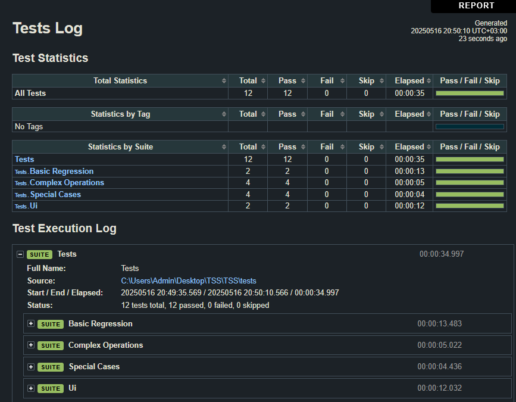
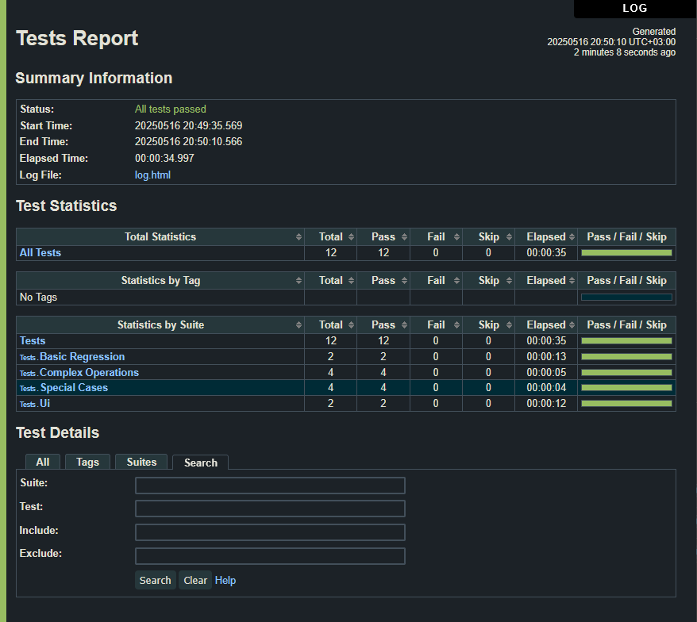
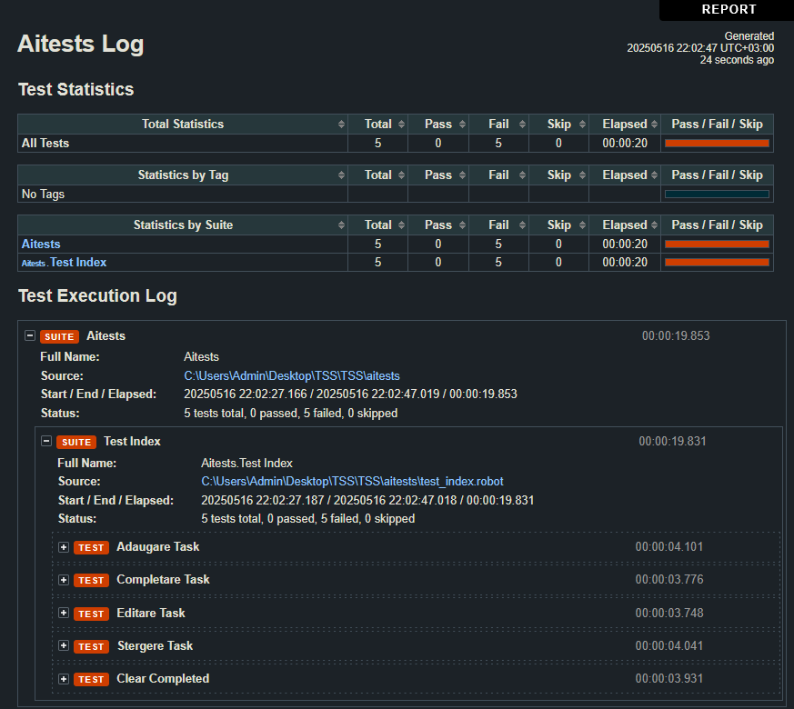

# Proiect Testare Software

## Cuprins
- [Descriere generală](#descriere-generală)
- [Definiții esențiale](#definiții-esențiale)
- [Strategii de testare](#strategii-de-testare)
- [Teste](#teste)
- [Configurație](#configurație)
- [Executare](#executare)
- [Capturi de ecran](#capturi-de-ecran)
- [Comparații rezultate/tool-uri](#comparații-rezultate-tool-uri)
- [Interpretări](#interpretări)
- [Video](#video)
- [Referințe bibliografice](#referințe-bibliografice)

---

## Descriere generală
Acest repository conține o aplicație de tip TODO și o suită de teste automate scrise cu Robot Framework și SeleniumLibrary.

## Definiții esențiale
- **Robot Framework** – un framework de testare open-source, bazat pe Python, care permite scrierea testelor în limbaj natural.
- **SeleniumLibrary** – o bibliotecă pentru Robot Framework care permite interacțiunea cu browserele web.
- **Testare funcțională** – verificarea funcționalității aplicației în conformitate cu cerințele specificate.
- **Testare pe mai multe browsere** – verificarea funcționalității aplicației pe diferite browsere web pentru a asigura compatibilitatea.
- **Testare de regresie** – verificarea funcționalității aplicației după modificări sau actualizări pentru a asigura că nu au fost introduse erori noi.

## Strategii de testare
- Testare funcțională
- Testare pe mai multe browsere (Chrome, Firefox)
- Testare de regresie

## Teste
```basic_regression.robot```

Rulat în Chrome și Firefox:
- Verifică titlul aplicației
- Verifică textul din pagină
- Adaugă un task și verifică dacă este activ
- Verifică dacă task-ul adăugat nu este completat
- Verifică dacă task-ul adăugat este vizibil în tab-ul cu toate task-urile
- Șterge task-ul și verifică dacă lista este goală
- Verifică dacă tab-urile pentru selectarea task-urilor mai există

```complex_operations.robot```
- Adaugă 5 task-uri
- Verifică dacă task-urile sunt adăugate
- Verifică dacă toate task-urile pot fi marcate ca fiind complete
- Verifică dacă toate task-urile pot fi marcate ca fiind incomplete

```special_cases.robot```
- Verifică dacă se pot adăuga task-uri fără caractere
- Verifică dacă se pot adăuga task-uri doar cu spații
- Verifică dacă un task cu titlu de script JavaScript poate fi exploatat pentru un atac XSS

```ui.robot```

Rulat în Chrome și Firefox:
- La o dimensiune mică a ferestrei, aplicația nu trebuie are scroll orizontal
## Configurație
În ```common.resource``` trebuie schimbat URL-ul aplicației cu cel corect. În cazul de față, aplicația este rulată de pe disc cu path absolut. În cazul unui path relativ, Firefox nu poate accesa aplicația.

PC personal pe care au fost rulate testele:
- Windows 11 23H2
- Procesor: Intel Core i9-11900K
- RAM: 32GB
- Python 3.13.1
- Browsere: chromedriver 136.0.7103.94 (Chrome), Firefox 138.0.3
- Biblioteci: Robot Framework 7.2.2, SeleniumLibrary 6.7.1

### Timp de execuție: 35s

## Executare
```
robot ./tests
```

## Capturi de ecran
<details>
    <summary>Capturi de ecran - teste scrise manual</summary>
    
    
</details>
<details>
    <summary>Capturi de ecran - teste AI Copilot</summary>
    
</details>

## Comparații rezultate/tool-uri
| Teste        | Teste trecute | Teste eșuate | Timp execuție |
|--------------|--------------|--------------|---------------|
| Scrise       | 12           | 0            | 35s           |
| AI Copilot   | 0            | 5            | 19s           |

## Interpretări
AI-ul va autogenera anumite teste, inspirate din baza de cod existentă, dar nu se poate adapta la toate cazurile de utilizare, mai ales în cazul aplicațiilor complexe. Chiar și în acest caz de utilizare cu o aplicație simplă, nu a reușit să genereze un test corect.\
Nu poate interpreta codul și să deducă ce trebuie să facă, doar preia din token-urile existente și le combină.\
De asemenea, logica este defectuoasă: pornește un browser pentru fiecare test, fără să testeze o secvență de teste, ceea ce este ineficient și poate să nu detecteze erori în cazul în care o operațiune depinde de alta.\
Într-adevăr, cu o revizuire umană a codului generat, se pot corecta erorile, dar nu este o soluție viabilă pentru un proiect mare. În plus, poate dura mai puțin să scrii un test de la zero decât să corectezi erorile generate de AI.

## Video
- [Video](https://youtu.be/qrdDQXWHdRA) (YouTube)

## Referințe bibliografice
- [Originalul aplicației TODO](https://github.com/johnfactotum/todomvc) – accesat la 16.05.2025
- [Robot Framework User Guide](https://robotframework.org/robotframework/latest/RobotFrameworkUserGuide.html) – accesat la 16.05.2025
- [SeleniumLibrary Documentation](https://robotframework.org/SeleniumLibrary/SeleniumLibrary.html) – accesat la 16.05.2025
- [GitHub Copilot](https://github.com/features/copilot) – accesat la 16.05.2025

---
